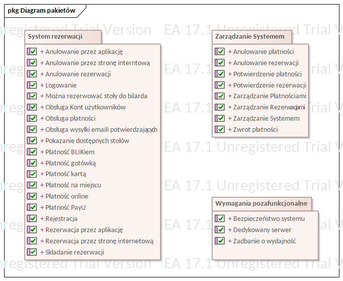

# 🎱 Billiard Table Reservation System — UML Project

## About the Project

This repository contains a UML model of a **Billiard Table Reservation System** — a software system designed to manage the process of reserving pool tables in a billiard club. The model covers the reservation lifecycle: from browsing available tables, reservation creation, and payment, to cancellation and refund handling.

The system serves three types of actors:

- **Guest (Klient Niezalogowany)** — can browse available tables and pay on-site at the venue.
- **Logged-in Client (Klient Zalogowany)** — can register, log in, create and cancel reservations, and pay online via **BLIK** or **PayU**, or in person by card or cash.
- **Administrator** — manages reservations and payments on the system side, can cancel bookings, process refunds, and delete user accounts.

External integrations include the **PayU** payment gateway, **BLIK** mobile payment system, and a **Mailing System** for sending reservation and cancellation confirmation emails.

The project was created using **Enterprise Architect 17.1**. To open the source model file (`.eap` / `.eapx`), Enterprise Architect is required. The diagrams exported as images are described below and can be viewed without the application.

---

## Table of Contents

1. [Package Diagram](#1-package-diagram-diagram-pakietów)
2. [Requirements Tree — System Rezerwacji](#2-requirements-tree--system-rezerwacji-custom-system-rezerwacji)
3. [Requirements — Wymagania Pozafunkcjonalne](#3-requirements--wymagania-pozafunkcjonalne-custom-wymagania-pozafunkcjonalne)
4. [Requirements Tree — Zarządzanie Systemem](#4-requirements-tree--zarządzanie-systemem-custom-zarządzanie-systemem)
5. [Use Case Diagram](#5-use-case-diagram-basic-use-case-model)
6. [Activity Diagram — Reservation Cancellation](#6-activity-diagram--reservation-cancellation-anulowanie-rezerwacji_activitygraph)
7. [State Machine Diagram — Reservation States](#7-state-machine-diagram--reservation-states-stany)
8. [Sequence Diagram — Online Payment](#8-sequence-diagram--online-payment-opłacanie-rezerwacji-przez-płatność-internetową)
9. [Communication Diagram — Online Payment](#9-communication-diagram--online-payment-opłacanie-rezerwacji-przez-płatność-internetową-communication)

---

## Diagrams

### 1. Package Diagram (`Diagram pakietów`)

The Package Diagram provides overview of the system's requirements, grouped into three packages:

- **System Rezerwacji (Reservation System)** — covers all client-facing functionalities, including user registration and login, browsing available tables, placing reservations via mobile app or website, handling payments (online, on-site, BLIK, card, cash, PayU), sending confirmation emails, and cancelling reservations.

- **Zarządzanie Systemem (System Management)** — groups the administrative functionalities: managing reservations and payments, confirming or cancelling them, and processing refunds.

- **Wymagania Pozafunkcjonalne (Non-Functional Requirements)** — defines quality and infrastructure requirements: system security, a dedicated server, and performance considerations.

---

### 2. Requirements Tree — System Rezerwacji (`custom System Rezerwacji`)

This custom requirements tree diagram breaks down the top-level requirement **"Możliwa rezerwacja stołów do bilarda"** (Billiard table reservation is possible) into its constituent functional requirements. The tree shows hierarchical relationships and dependencies between features:

- **Obsługa Kont Użytkowników** (User Account Management) — includes *Logowanie* (Login) and *Rejestracja* (Registration).
- **Składanie Rezerwacji** (Making a Reservation) — the central feature, connected via a `«derive»` relationship to *Obsługa Płatności*. It encompasses:
  - Reservation via mobile app
  - Reservation via website
  - Viewing available tables
  - Sending confirmation emails
- **Obsługa Płatności** (Payment Handling) — connected via a `«trace»` relationship to the reservation process. Supports:
  - Online payment → BLIK, PayU
  - On-site payment → Cash, Card
- **Anulowanie Rezerwacji** (Cancelling a Reservation) — includes cancellation through the website and through the mobile app.

Colour coding on the diagram indicates requirement status or priority (green = completed/low risk, yellow = medium, orange = in progress, red = high priority/risk).

---

### 3. Requirements — Wymagania Pozafunkcjonalne (`custom Wymagania pozafunkcjonalne`)

This diagram presents the three **non-functional requirements** of the system, each described with metadata tags:

| Requirement | Risk Factor | Risk Level | Acceptance Date | User-Facing |
|---|---|---|---|---|
| **Dedykowany serwer** (Dedicated Server) | Environmental | Medium | 06/11/2025 | No |
| **Bezpieczeństwo systemu** (System Security) | Security | High | 05/11/2025 | No |
| **Zadbanie o wydajność** (Performance) | Electrical | Low | Not set | No |

All three non-functional requirements are internal (not directly exposed to end users).

---

### 4. Requirements Tree — Zarządzanie Systemem (`custom Zarządzanie Systemem`)

This custom requirements tree diagram expands the **"Zarządzanie Systemem"** (System Management) package into its sub-requirements, showing how the top-level administrative feature is decomposed:

- **Zarządzanie Rezerwacjami** (Reservation Management):
  - Potwierdzenie rezerwacji (Reservation Confirmation)
  - Anulowanie rezerwacji (Reservation Cancellation)

- **Zarządzanie Płatnościami** (Payment Management):
  - Potwierdzenie płatności (Payment Confirmation)
  - Anulowanie płatności (Payment Cancellation)
  - Zwrot płatności (Payment Refund)

Colour coding follows the same convention as the System Rezerwacji diagram, indicating status and risk level per requirement.

---

### 5. Use Case Diagram (`Basic Use Case Model`)

The Use Case Diagram illustrates the interactions between the system's actors and its core functionalities. The central use case is **"Rezerwowanie stołu do bilardu"** (Reserving a billiard table), highlighted in yellow as the primary system goal.

**Actors:**

- **Klient Niezalogowany** (Guest / Unauthenticated Client) — can browse available tables and pay for a reservation on-site.
- **Klient Zalogowany** (Logged-in Client) — can perform all reservation-related actions: reserving a table, paying via BLIK or online payment, and cancelling a reservation.
- **Administrator** — can cancel reservations, delete user accounts, process payment refunds, and contact stakeholders.
- **System Mailingowy** (Mailing System) — an external actor responsible for sending confirmation emails.
- **System Blik** — external payment actor handling BLIK transactions.
- **System PayU** — external payment actor handling PayU online payments.

**Use Case Relationships:**

- **«include»** — the reservation process always includes: payment via BLIK, payment via online transfer, sending a reservation confirmation email, and sending a cancellation confirmation email.
- **«extend»** — optional extensions of the core use case: browsing table availability (extended by the guest), and cancellation of a reservation (extended by the administrator via refund or stakeholder contact).

---

### 6. Activity Diagram — Reservation Cancellation (`Anulowanie rezerwacji_ActivityGraph`)

This Activity Diagram describes the full step-by-step flow of **cancelling a reservation** from the user's perspective, including database interactions and refund logic.

**Flow summary:**

1. **Fetch active reservations** — the system retrieves all active reservations for the logged-in user from the database.
   - If a data inconsistency is detected at any point, the system displays an error message ("Coś poszło nie tak" / "Something went wrong") and loops back to retry.
   - If the user has **no reservations**, the system displays a "Brak rezerwacji" (No reservations) message and ends the flow.

2. **Display reservations** — if at least one reservation exists, the system shows a table with detailed information and a "Cancel reservation" button for each entry.

3. **User initiates cancellation** — the user clicks the cancel button next to the chosen reservation (marked as *Anulowanie akcji*).

4. **Confirmation dialog** — a dialog box asks "Are you sure you want to cancel this reservation?". The user confirms by clicking "Yes".

5. **Refund eligibility check** — the system evaluates the `CzyZwrot` (RefundEligible) flag:
   - **Flag is true** → the user is informed that a refund will be issued.
   - **Flag is false** → the user is informed that no refund will be issued due to insufficient time before the reservation.
   - The user acknowledges the refund or no-refund information.

6. **Re-fetch flag from database** — the `CzyZwrot` flag is re-read from the database to detect any concurrent changes.
   - If the value has changed since it was shown to the user → **data inconsistency** is triggered.

7. **Update reservation status** — the reservation record is updated to status "anulowana" (cancelled).

8. **Conditional refund** — if `CzyZwrot` is true, a refund is issued to the client.

9. **Finalisation** — in parallel:
   - A cancellation confirmation email is sent to the user (reference: `PU.RB.11`).
   - A success message "Rezerwacja została anulowana" (Reservation has been cancelled) is displayed.

---

### 7. State Machine Diagram — Reservation States (`Stany`)

The State Machine Diagram models all possible **states of a reservation** throughout its lifecycle, along with the transitions between them.

**States:**

| State | Description |
|---|---|
| **Nieopłacona** (Unpaid) | Initial state after a reservation is created but not yet paid. |
| **Płatność rozpoczęta** (Payment Started) | Entered when the user clicks "Opłać Rezerwację" (Pay for Reservation). On entry: the payment amount is fetched; the PayU or BLIK payment process is initiated. |
| **Opłacona** (Paid) | Reached when `Rezerwacja.transaction_id != null`, meaning the payment was successfully processed. |
| **Anulowana Nieopłacona** (Cancelled — Unpaid) | Reached from *Nieopłacona* when the user clicks "Anuluj Rezerwację" (Cancel Reservation). |
| **Anulowana Opłacona** (Cancelled — Paid) | Reached from *Opłacona* when the user cancels a paid reservation. Triggers the refund process. |
| **Odmowa zwrotu** (Refund Denied) | Reached when the reservation date is within 1 day (`Rezerwacja.Data - Dzisiaj <= 1 dzień`) — refund is not granted. |
| **Przyznano zwrot** (Refund Granted) | Reached when the reservation date is further away (`else` branch). On entry: the refund amount is fetched; on do: PayU processes the refund; on exit: a confirmation email is sent. |
| **Archiwalna** (Archived) | Final state for paid reservations where `Rezerwacja.Data > Dzisiaj` (the reservation date has passed). |

---

### 8. Sequence Diagram — Online Payment (`Opłacanie rezerwacji przez płatność internetową`)

This Sequence Diagram illustrates the message flow between system components when a logged-in user pays for a reservation **online**.

**Participants:** Klient Zalogowany (Logged-in Client), Widok rezerwacji (Reservation View), Zarządzanie widokiem (View Controller), :Rezerwacja (Reservation object), :Płatność (Payment object), Serwis płatności (Payment Service), PayU.

**Flow:**

1. The View Controller fetches the reservation (`pobierz(int): Rezerwacja`) and displays it to the user (`wyświetl(Rezerwacja)`).
2. The user triggers `zapłać_online()` on the Reservation View.
3. The View calls `wykonaj_płatność()` on the Controller, which calls `rozpocznij_płatność(): Płatność` on the Reservation object.
4. The Payment Service is called with `rozpocznij_platnosc(Płatność)`, which creates a `:Płatność` object, processes the payment status (`przetwórz(Status_płatności)`), and initiates PayU via `rozpocznij_payu()`.
5. **alt [płatność udana]** (payment successful):
   - PayU returns `transakcja_udana()` to the Controller.
   - The Controller confirms the payment (`potwierdź_płatność()`) and displays success (`wyświetl_udana_płatność()`).
6. **[else]** (payment failed):
   - PayU returns `płatność_nieudana()`.
   - The View displays a failure message (`wyświetl_nieudana_płatność()`).

---

### 9. Communication Diagram — Online Payment (`Opłacanie rezerwacji przez płatność internetową Communication`)

This Communication Diagram presents the same **online payment** scenario as the Sequence Diagram above, but focuses on the relationships and numbered message flow between objects rather than the timeline.

**Participants:** Klient Zalogowany, :Rezerwacja, Widok rezerwacji, Zarządzanie widokiem, :Płatność, Serwis płatności, PayU.

**Numbered message sequence:**

- `1: pobierz(int): Rezerwacja` — fetch reservation data.
- `1.1: wyświetl(Rezerwacja)` — display reservation to the user.
- `2: zapłać_online()` — user initiates online payment.
- `2.1: wykonaj_płatność()` — controller executes payment logic.
- `2.1.1: rozpocznij_płatność(): Płatność` — reservation starts the payment process, creating a `:Płatność` object.
- `2.1.2: rozpocznij_platnosc(Płatność)` — payment service is called.
- `2.1.2.1: przetwórz(Status_płatności)` — payment status is processed.
- `2.1.2.2: rozpocznij_payu()` — PayU session is created (`«create»`).
- `2.1.2.2.1: [płatność udana]: transakcja_udana()` — success callback from PayU.
- `2.1.2.2.2: [else]: płatność_nieudana()` — failure callback from PayU.
- `2.1.3: [płatność udana]: potwierdź_płatność()` — payment confirmed in the system.
- `2.1.2.3: [else]: wyświetl_nieudana_płatność()` — failure displayed to user.
- `2.1.4: [płatność udana]: wyświetl_udana_płatność()` — success displayed to user.

---

